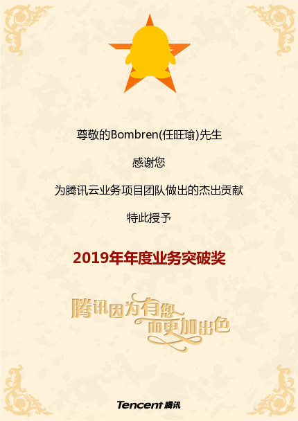
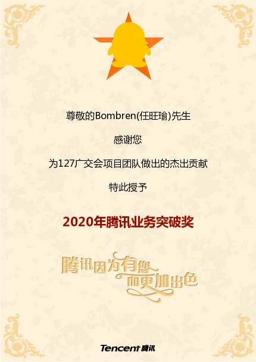
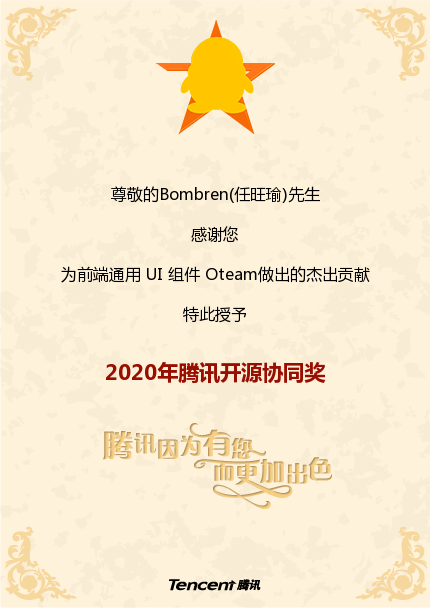
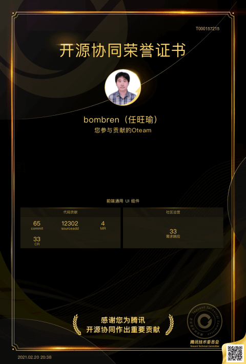
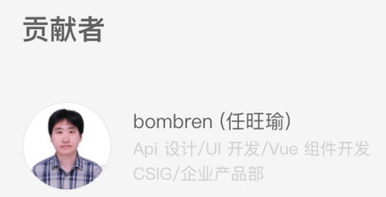

# 腾讯科技（上海）有限公司
----
技术中心：主要负责腾讯云下产品的开发

## **智能客服机器人**
参与了腾讯云下产品企点账户中心智能客服机器人从版本3.2~3.8的主要开发。把机器人和问答库从单个变多个，并增加了行业内有竞争力的优势功能，在开发期间任前端主要开发负责，与产品技术测试沟通，共同完成每个版本的迭代。短短两年时间将机器人的销售提升几倍。并多次获得了公司的表扬和奖励。

主要参与功能有：
+ 从单机器人变为多机器人
+ 从单人聊天机器人扩展为群机器人
+ 从单轮问答增强为多轮问答
+ 增加支持接口和自定义能力的任务型问答
+ 在pc端产品上支持机器人的人机辅助，知识库检索等。

***技术栈：vue，nodeJS***

## **北京国网电力重点保障**
北京国网电力作为重要的企业客户，定制了针对其使用场景的功能。在保证产品原先功能的同时，积极与重要客户沟通协调，完成了客户的需求，并获得了客户的一致好评。
主要参与功能有：
+ 接待单系统
+ 国网机器人定制化

***技术栈：vue，nodeJS***

## **127届广交会线下支持**
127届广交会因为疫情关系，改为云上参会，团队作为127广交会的重要技术支持，在为时极短的情况下顶住压力，开发广交会需要的各项功能，并且在会议期间提供加班加点提供技术支持。圆满保证了127届广交会的顺利进行。

## **公司级前端开源项目TDesign**
TDesign是一款为了提升研发效能、减少重复轮子，建设公司统一的UI组件库。已经提供了适配 PC 端交互的 Vue、React、Angular 版本，和适配移动端交互的 Vue、小程序组件库版本，支持按需加载。积极参与公司开源共建，并认领了tabs组件的开发，配合视觉交互，完成api设计，属性设计和代码的编写，为公司的开源贡献力量。

***技术栈：vue***

## **团队开源贡献**
参与团队的开源组件开发，主要包括
+ 业务公共组件物料库
+ 符合bpmn规范的工作流前端库。
+ 富文本解析插件
+ 组件库配套的babel插件

***技术栈：vue***